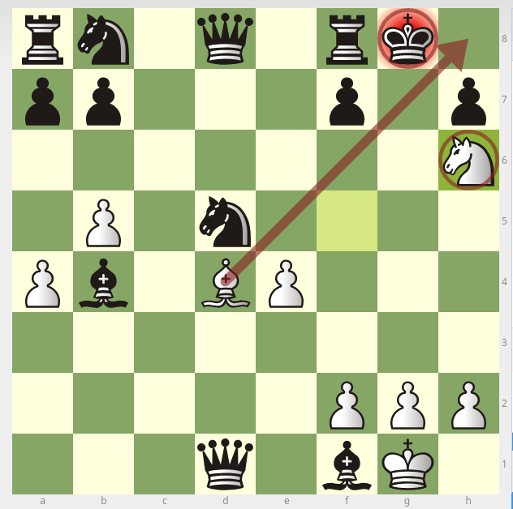
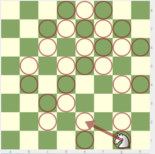
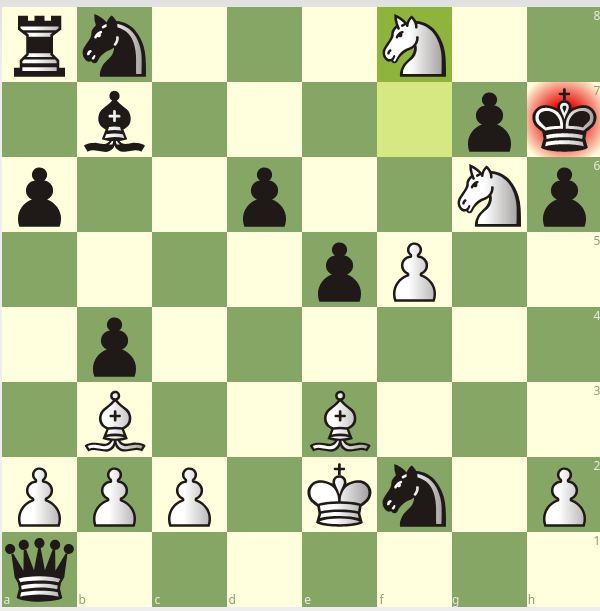
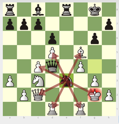
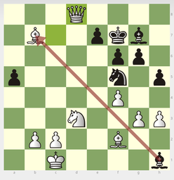
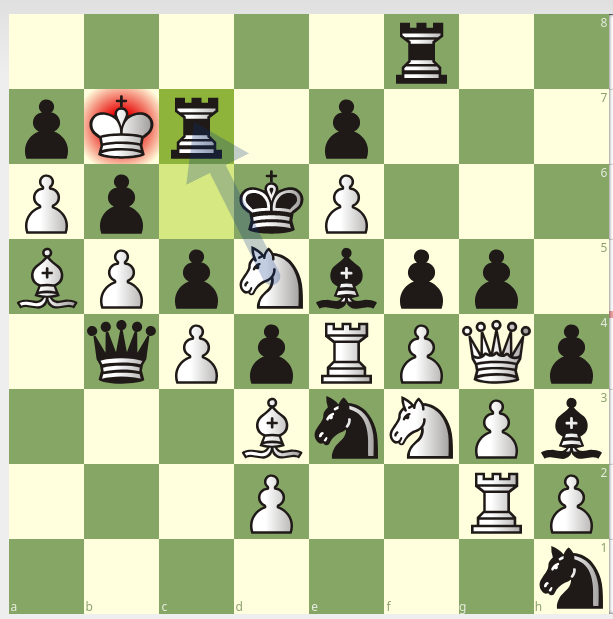
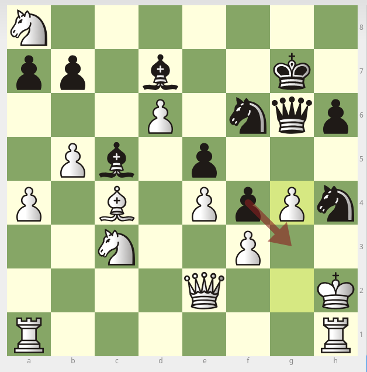

## Chessfactory: hall of fame

The purpose of this project is to explore the [lichess database](https://database.lichess.org/)for interesting games and positions. As an example, I created my list of interesting parties by various criteria (see below).

Originally, [Chessfactory](https://github.com/mark-dev/chessfactory) is my study web chess project, inspired by [lichess](https://lichess.org).

This project has same name prefix, because it also study and inspired by lichess :)

Used tools:

* [lichess database](https://database.lichess.org/) 
* My fork of [chesspresso java lib](https://github.com/mark-dev/chesspresso)
* [Spring](https://spring.io/) with [Spring integration](https://spring.io/projects/spring-integration)
* [Clickhouse](https://clickhouse.yandex/)

  
I scan lichess database(there was 602M games at march 2019) and here is my results:

1. [List games where defeated side has piece advantage](etc/docs/results/got-mate-with-extra-material.md)  

      

2. [Find longest uncrossed knight path in real games](/etc/docs/results/knight-path.md)

    [Read more about this problem(wikipedia)](https://en.wikipedia.org/wiki/Longest_uncrossed_knight%27s_path)

    
    
3. [List games, where mate reaches by piece promotion, and winning side has less material](/etc/docs/results/mate-by-pieces.md)
   
   
   
   [game from picture](https://lichess.org/oKgxoBoi)
   
4. [List games by strongest knight fork (by fork-ed material)](etc/docs/results/fork-material.md)
  
   
   
5. [List games sorted by average ranged pieces(B,R,Q) capture distance](etc/docs/results/ranged-capture-distance.md):
    
    
   
6. [List positions where side can do a lot of captures?](etc/docs/results/capture-sharpness.md)

   
   
   [Game from picture](https://lichess.org/shIhqTdO#68)
    
7. [List positions where 8 pieces stay on one board-column](etc/docs/results/8-pieces-one-column.md)

    
    
8. [List games ended by en passant mate](etc/docs/results/ep-mate.md) 

    
    
9. Has ideas?
     
    Your turn :) 

    If you interested you can [read more about tecnhical aspects](etc/docs/how-to-extend.md) 
    and implement your own chess research ideas.

   
